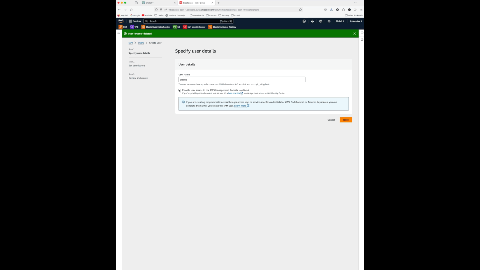
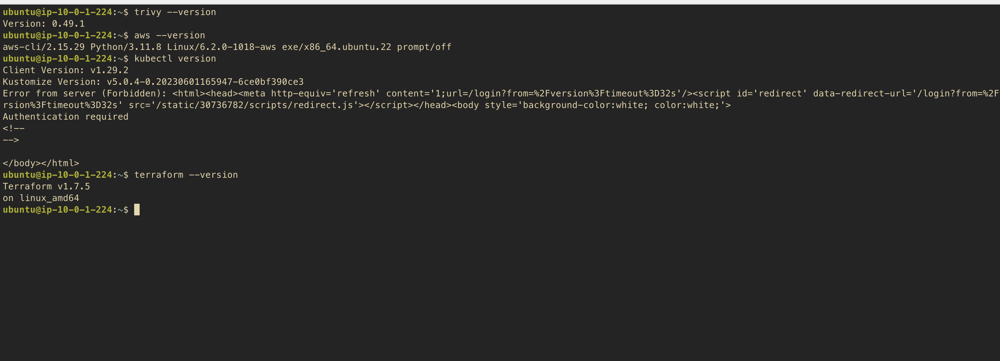
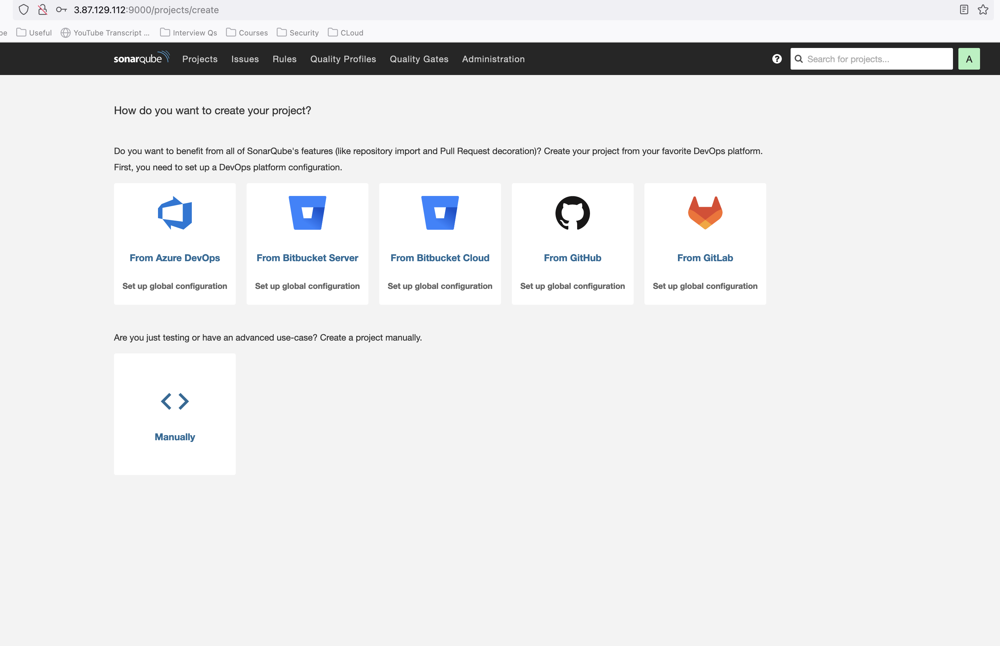
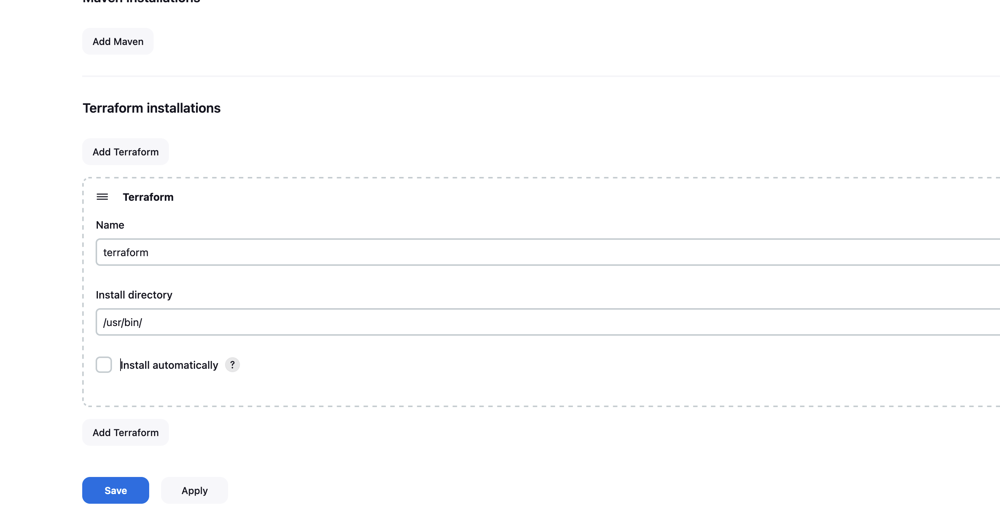
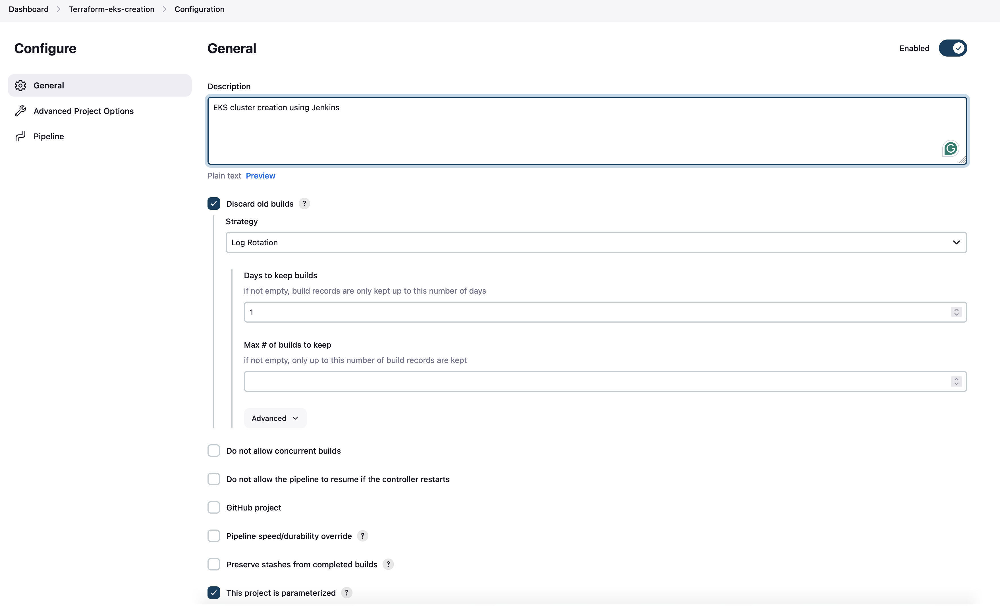
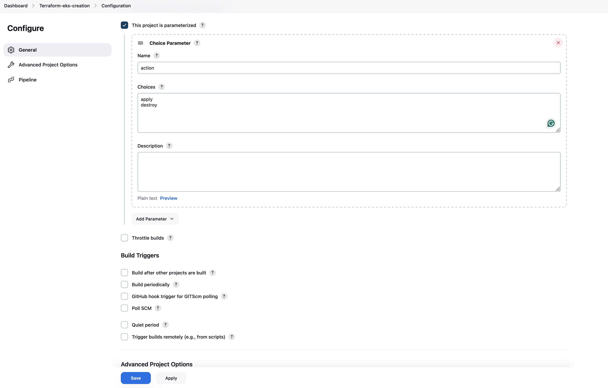
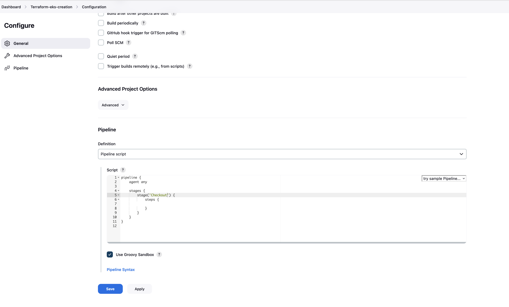

# Deployment of Tetris game using DevSecOps Best Practices

In this Project, we will explore how cutting-edge technologies like ArgoCD, Terraform, and Jenkins can be used to deploy the classic game Tetris. We will discuss the seamless and secure deployment pipeline that these tools enable, allowing for smooth transitions between different stages of development, from infrastructure provisioning to continuous integration and delivery.

Several tools such as terraform to provision infrastructure, Jenkins to automate the CI/CD pipeline, and ArgoCD to manage the deployment of the game will be used. SonarQube will be used to ensure the quality of the code, and Trivy will be used to scan the Docker images for vulnerabilities. We use OWASP ZAP to scan the game for security vulnerabilities. And we will deploy everything on AWS.

Later, we can introduce a service mesh using Istio to manage the traffic between the different microservices of the game. We can also use Prometheus and Grafana to monitor the game and the infrastructure.

## Prerequisites

- [Docker](https://www.docker.com/)
- [AWS CLI](https://aws.amazon.com/cli/)
- [Terraform](https://www.terraform.io/)
- [kubectl](https://kubernetes.io/docs/tasks/tools/install-kubectl/)
- [ArgoCD CLI](https://argoproj.github.io/argo-cd/cli_installation/)
- [S3 Bucket](https://aws.amazon.com/s3/)
- [Jenkins](https://www.jenkins.io/)

Let us start by provisioning a working container so that we don't have to install any software on our local machine.

```bash

# Run a working container
docker run -it --rm --net host --name working-container \
-v /var/run/docker.sock:/var/run/docker.sock \
-v ${PWD}:/work \
-w /work alpine:3.19.1 sh

```

```bash
mkdir -p /cmd
```

Install common utilities

```bash
# Install common utilities and beautify the terminal
apk update
apk add --no-cache docker curl wget python3 py3-pip python3-dev libffi-dev openssl-dev gcc libc-dev make  zip bash openssl git mongodb-tools openssl git docker-compose zsh vim nano bash unzip npm openjdk17 openssh
# Install zsh for a cool looking terminal with plugins auto-suggestions and syntax-highlighting
sh -c "$(curl -fsSL https://raw.github.com/robbyrussell/oh-my-zsh/master/tools/install.sh)"

## Clone the zsh-autosuggestions repository into $ZSH_CUSTOM/plugins
git clone https://github.com/zsh-users/zsh-autosuggestions.git $ZSH_CUSTOM/plugins/zsh-autosuggestions
git clone https://github.com/zsh-users/zsh-syntax-highlighting.git $ZSH_CUSTOM/plugins/zsh-syntax-highlighting
sed -i.bak 's/plugins=(git)/plugins=(git zsh-autosuggestions zsh-syntax-highlighting)/' ~/.zshrc

# Install kubectl
curl -LO https://storage.googleapis.com/kubernetes-release/release/`curl -s https://storage.googleapis.com/kubernetes-release/release/stable.txt`/bin/linux/arm64/kubectl
chmod +x ./kubectl
mv ./kubectl /usr/local/bin/kubectl

# Install helm
curl -LO https://get.helm.sh/helm-v3.7.2-linux-arm64.tar.gz
tar -C /tmp/ -zxvf helm-v3.7.2-linux-arm64.tar.gz
rm helm-v3.7.2-linux-arm64.tar.gz
mv /tmp/linux-arm64/helm /usr/local/bin/helm
chmod +x /usr/local/bin/helm

# Get Terraform
wget https://releases.hashicorp.com/terraform/1.6.1/terraform_1.6.1_linux_arm64.zip
unzip terraform_1.6.1_linux_arm64.zip
mv terraform /usr/local/bin/
chmod +x /usr/local/bin/terraform
rm terraform_1.6.1_linux_arm64.zip
terraform version


# Install kind to access the cluster
wget https://github.com/kubernetes-sigs/kind/releases/download/v0.11.1/kind-linux-arm64
chmod +x kind-linux-arm64
mv kind-linux-arm64 /usr/local/bin/kind
kind version

# 4. Install ArgoCD CLI

wget argocd-linux-arm64 https://github.com/argoproj/argo-cd/releases/latest/download/argocd-linux-arm64
install -m 555 argocd-linux-arm64 /usr/bin/argocd
rm argocd-linux-arm64

# 5. Install AWS CLI
python -m venv pyenv
source pyenv/bin/activate
pip install awscli==1.32.63

# Install nvm
wget -qO- https://raw.githubusercontent.com/nvm-sh/nvm/v0.39.7/install.sh | bash
```

Deleting in linux is a dangerous operation, let us create a script to confirm before deleting

```bash
cat << 'EOF' > /cmd/confirm_rm_rf.sh
#!/bin/sh
printf "Do you really wanna delete (yes/no) \n===>: "
# Reading the input from terminal
read answer
if [ $answer == "yes" ]
then
  rm -rf $@
elif [ "$answer" !=  "yes" ]
then
  printf "You didn't confirm!\nExiting, no action taken!"
fi
EOF
chmod +x /cmd/confirm_rm_rf.sh
cat /cmd/confirm_rm_rf.sh


# ---
cat << 'EOF' >> ~/.zshrc
source $ZSH/oh-my-zsh.sh
source $ZSH_CUSTOM/plugins/zsh-autosuggestions
source $ZSH_CUSTOM/plugins/zsh-syntax-highlighting
export PATH="$PATH:/cmd"
alias rm="confirm_rm_rf.sh"
export JAVA_HOME=/usr/lib/jvm/java-17-openjdk
EOF
cat ~/.zshrc

# To apply the changes, the auto-suggestions and syntax-highlighting plugins must be sourced:
source ~/.zshrc
chown -R 1000:1000 .
zsh
```

The next step is to create a new IAM user with the necessary permissions to access the AWS resources. We will use the AWS CLI to create the user and generate the access keys.

We can use the video below:

[](https://drive.google.com/file/d/1HIgaQPPhv_ElOLUWnVekphbeqwhsVgdN/view)

After this process, create a key pair and download the .pem file. We will use this key pair to access the EC2 instances. You have to use the credentials downloaded earlier, and then login as IAM user. Once on the EC2 dashboard, click on the "Create a key pair" button and download the .pem file.

## Provisioning the Infrastructure

We can use terraform to provision the infrastructure. Terraform is an open-source infrastructure as code software tool that provides a consistent CLI workflow to manage hundreds of cloud services. It codifies APIs into declarative configuration files, creating a versioned infrastructure.

Head to folder Tetris-V1 and run the following commands:

```bash
aws s3 mb s3://my-bucket-22112 --region us-east-1
```

to create a bucket to store the state.

```bash
cd Tetris-V1
terraform init
terraform plan --out
terraform apply --auto-approve
```

Change the permissions of the .pem file to 600

```bash
chmod 600 keypair.pem
```

SSH into the EC2 instance

```bash
ssh -i "keypair.pem" ubuntu@ec2-3-87-129-112.compute-1.amazonaws.com
```

Head to Jenkins by visiting the public IP of the EC2 instance on port 8080. The default username is admin and the password can be found in the logs of the Jenkins container.

```bash
http://3.87.129.112:8080
```

To get the password, run the following command:

```bash
sudo cat /var/lib/jenkins/secrets/initialAdminPassword
```

Check if what we installed in the ec2 instance is working




Before, we can run the Jenkins pipeline, we need to import some plugins. We can use the script below to import the plugins.

Dashboard -> Manage Jenkins -> Manage Plugins -> Plugins > available plugins

Search for:

- Terraform

Install the plugins and restart Jenkins.

< Manage Jenkins -> Tools > Terraform installations



---

Let us create the first job to build the game. We can use the script below:

New Item -> Terraform-eks-creation > pipeline




